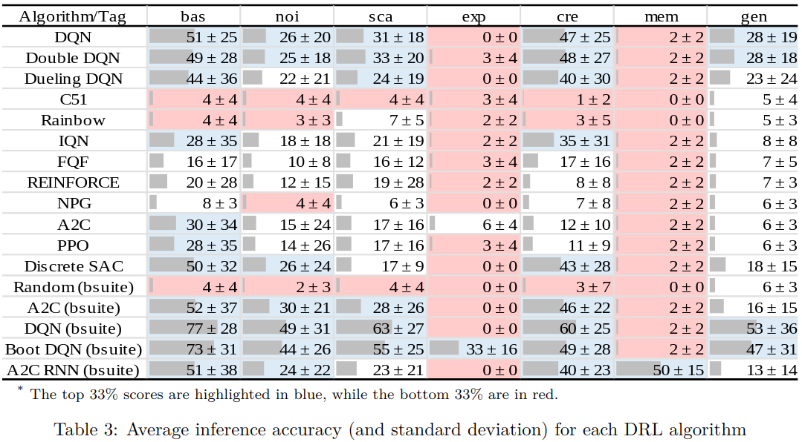
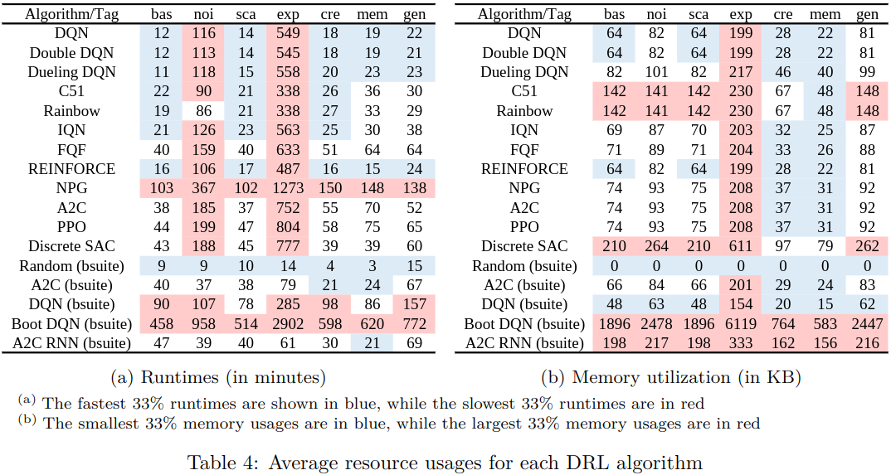

# Resource Usage Evaluation of Discrete Model-Free Deep Reinforcement Learning Algorithms
Code to run various Deep Reinforcement Learning (DRL) algorithms in the [bsuite](https://github.com/google-deepmind/bsuite) suite of environments.
The goal is to evaluate the practicality of discrete, model-free deep RL algorithms by characterizing their performance, runtime, and memory usage in a variety of different types of environments.
Code in this repository was used for the paper "Resource Usage Evaluation of Discrete Model-Free Deep Reinforcement Learning Algorithms", accepted at the Reinforcement Learning Conference (RLC) 2024.
For more information, please refer to our paper (link pending as paper is currently in press)




## Installation
Code was run on Python 3.8.16. To install dependencies in a virtual environment, please download the [requirements.txt](requirements.txt) file and run

```bash
conda create --no-default-packages -n myenv python=3.8.16
conda activate myenv
pip install -r requirements.txt
```
## Technical Overview and Repository Organization
For this study, sixteen DRL algorithms were trained in 23 different base environments (468 seeds), resulting in a total of 7,488 trained agents.
Experiments were conducted on NVIDIA GeForce 2080Ti nodes, each with a cyclic allocation of 16GB CPU and 11GB GPU for processing. 
In total, it took 256 GB and 830 days CPU time (i.e., sixty-nine days on a twelve-node parallel system) to run all experiments and 1.8 GB to store all models.
This repository contains the python scripts from this study. 

This repository is organized into three main folders:
1. _demos/_ contains short snippets of code to ensure the python environment is set up correctly. It also contains the code used to evaluate the RL agents
2. _bsuite_runners/_ contains the programs used to train the bsuite baseline RL algorithms for the paper. For more information, please refer to the [bsuite](https://github.com/google-deepmind/bsuite) repository on GitHub
3. _tianshou_runners/_ contains the programs used to train the tianshou RL algorithms for the paper. For more information, please refer to the [tianshou](https://github.com/thu-ml/tianshou) repository on GitHub

## Project status
Completed, pending release. TODO: add paper link and bibtex information to the README upon paper publication.

## Citing
If you use this in your work, please cite the accompanying paper:

```bibtex
@article{dizon2023investigating,
  doi = {10.36227/techrxiv.23739099.v1},
  url = {https://doi.org/10.36227/techrxiv.23739099.v1},
  year = {2023},
  month = jul,
  publisher = {Institute of Electrical and Electronics Engineers ({IEEE})},
  author = {Olivia Dizon-Paradis and Stephen Wormald and Daniel Capecci and Avanti Bhandarkar and Damon Woodard},
  title = {Investigating the Practicality of Existing Reinforcement Learning Algorithms: A Performance Comparison}
}
```